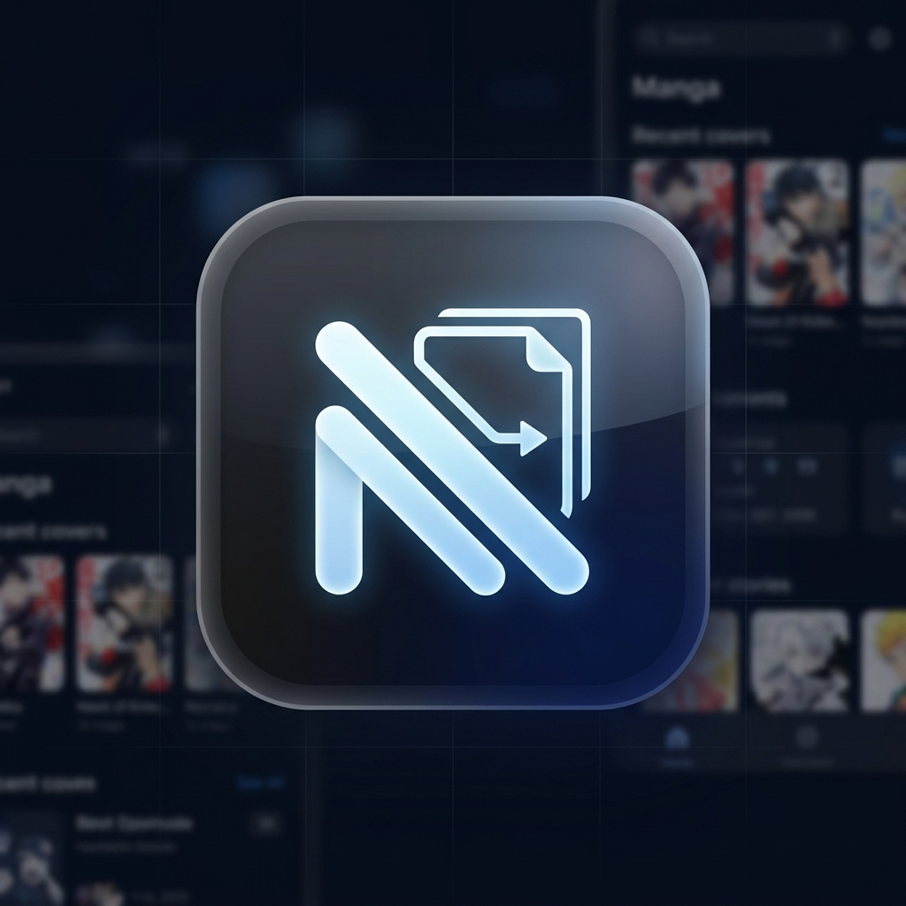
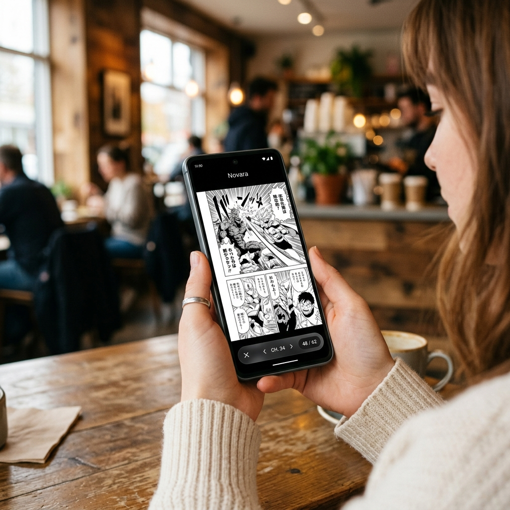

<div align="center">
  <h1> Novara</h1>
  <p>A fast, extensible, and minimalist manga reader for Android.</p>
  <br/>
  
</div>

<br/>

## 🌟 Overview

**Novara** is a modern Android manga reader designed with a minimalist, "One UI" aesthetic. Built on modern architecture and focusing on user experience, Novara provides a buttery-smooth reading experience while giving you ultimate control over how you consume your manga.

## ✨ Features

- **Minimalist One UI Design**: A sleek, unintrusive reader menu with rounded corners, translucent elements, and clean animations.
- **Super Customizable**: Toggle tools, timers, and progress indicators on and off to fit your reading style.
- **High Performance**: Optimized image loading, smooth scrolling, and memory-efficient pagination.
- **Extensible Sources**: Plug in your favorite manga extensions easily.
- **Built-in Translation**: Seamless reading of untranslated raw chapters using translation layers.
- **Gestures & Controls**: Configure tap zones, zoom behaviors, and scrolling modes exactly to your liking.

## 📥 Installation

You can download the latest APK directly from the [Releases](https://github.com/BiniFn/Novara/releases) page or from the **Actions** tab if you want the cutting-edge builds.

## 🛠️ Building from Source

To build Novara yourself:

1. Clone the repository:
   ```bash
   git clone https://github.com/BiniFn/Novara.git
   ```
2. Open the project in **Android Studio**.
3. Let Gradle sync and download dependencies.
4. Build the `assembleDebug` or `assembleRelease` variant.

Alternatively, via command line:
```bash
./gradlew assembleDebug
```

## 📄 License

Novara is licensed under the **GNU General Public License v3.0**. See the `LICENSE` file for more details.
