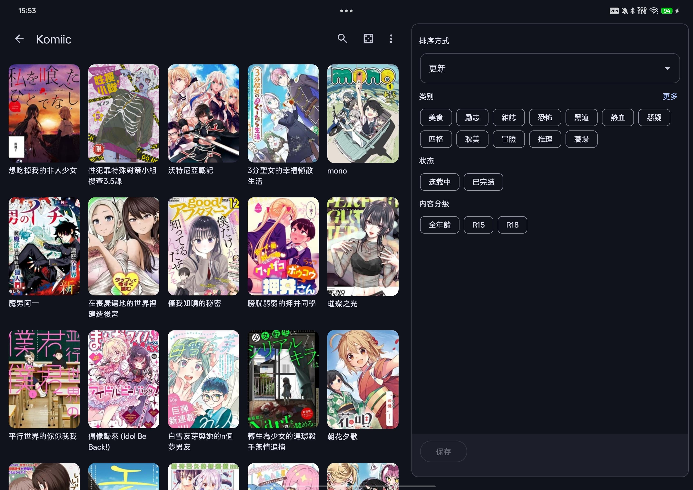
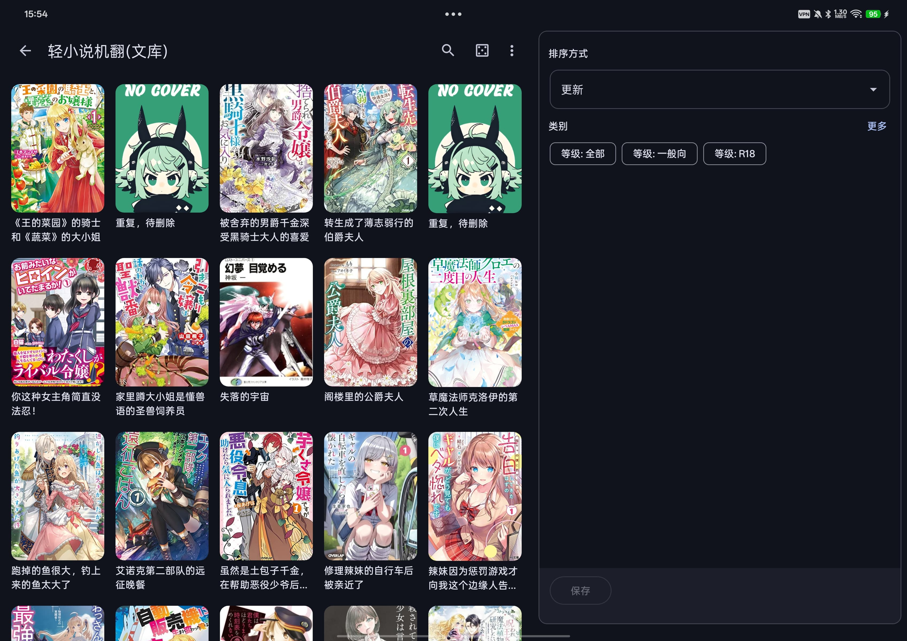
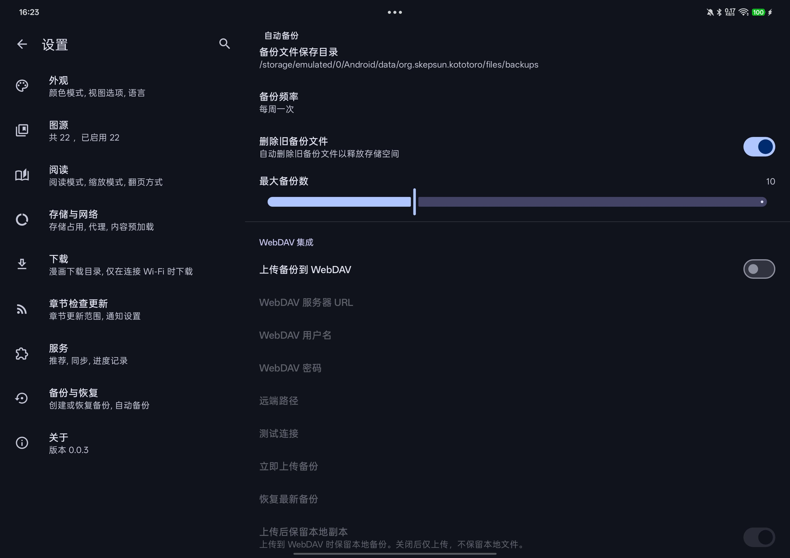

# Kototoro - Manga/Novel/Video Reader


[](README.md) [](README_en.md) 

## 📖 Project Introduction

**Kototoro** is an unofficial fork project based on **Kotatsu**, focused on providing a better manga, novel, and video reading/playing experience for Chinese users.

### 🚀 Recent Updates (v0.2.5)
1. **Mihon / Aniyomi Extension Support**: Full support for Mihon (manga) and Aniyomi (anime/video) extensions, significantly expanding the available content sources.
2. **Manga Source Management System**: Implemented a comprehensive manga source management system, including network requests, UI components, and source import functions.
3. **Performance & Stability**:
    - Improved video player compatibility by automatically removing request headers that cause 400 errors.
    - Optimized Explore page UI layout with a more compact and elegant tab bar.
    - Enhanced ProGuard obfuscation rules to increase Release version stability.
4. **CI/CD Optimization**: Automatic Release changelog generation and support for manual-triggered releases.

### 🎯 Key Features

#### 🌟 Core Features
- ✅ **Chinese Site Optimization** - Deep optimization for Chinese manga, video, and novel sites.
- ✅ **Versatile Reader** - Inherits all excellent manga reading functions from Kotatsu.
- ✅ **Video Playback** - Supports online video streaming with features like quality switching and screen rotation lock.
- ✅ **Enhanced Novel Reading** - Supports seamless switching between online/local novel reading, image display, illustrated chapters, and EPUB downloads.
- ✅ **Download Management** - Supports custom download delays (to avoid rate limits), making the download process more stable.
- ✅ **Foldable Device Adaptation** - Perfectly adapted for foldable devices, supporting dual-page mode and adaptive layouts.
- ✅ **WebDAV Sync** - Automatic cross-device backup/restore of favorites, history, groups, login credentials, and more.
- ✅ **Site Favorite Import and Sync** - Support for importing favorites from logged-in sites to local, or syncing local favorites back to the site.
- ✅ **Mihon / Aniyomi Extension Support** - Full support for Mihon and Aniyomi extensions, significantly expanding the available content sources.

## Screenshots
<div align="center">
    
    
    
    
    
    
    
    
</div>

## 🎮 Usage Guide

### 🧩 Mihon / Aniyomi Extensions Guide

Kototoro now supports both Mihon (formerly Tachiyomi) and Aniyomi extension systems. You can add and use more content sources by following these steps:

1. **Install and Configure Apps**:
   - Install the official [Mihon](https://mihon.app/) (for manga) or [Aniyomi](https://aniyomi.org/) (for anime/video) application.
   - Add extension repositories in the respective app (e.g., Mihon's [Keiyoushi](https://keiyoushi.github.io/extensions/)).
   - Download and install the source extensions you need.
2. **Use in Kototoro**:
   - Open Kototoro and tap "Browse" in the bottom navigation.
   - Switch to the "Mihon" or "Aniyomi" tab. The app will automatically detect installed extensions on your device.
   - You can browse and use these sources directly from here.
3. **Force Refresh Detection**:
   - If newly installed extensions don't appear, go to "Settings" → "Content Source" → "Mihon / Aniyomi Extensions".
   - Pull down to refresh the page and force a re-detection of installed extensions.

> [!NOTE]
> Kototoro achieves compatibility by detecting extension APKs installed on your system. Please ensure the extensions are correctly installed on your device.

### ☁️ WebDAV Sync

1. **Configure WebDAV** - Set up your WebDAV server in "Settings → Backup & Restore".
2. **Auto Backup** - Reading progress, favorites, and history automatically sync to the cloud.
3. **Multi-Device Sync** - Seamlessly sync reading state across different devices.
4. **Smart Merge** - Timestamp-based intelligent merging to avoid data conflicts.

### 📥 Site Favorite Import/Sync

Support for importing favorites from logged-in sites to local, or syncing local favorites back to the site.

#### Supported Sites

| Site | Import Favorites | Sync Favorites | Remarks |
| :--- | :---: | :---: | :--- |
| CopyManga | ✅ | ✅ | Login required |
| Zaimanhua | ✅ | ✅ | Login required |
| Komiic | ✅ | ✅ | Login required |
| Baozi Manga | ✅ | ✅ | Login required |
| Manhuagui | ✅ | ✅ | Login required |
| Hentai Manga | ✅ | ✅ | Login required |
| Pica Manga | ✅ | ✅ | Login required |

#### How to Use

1. **Import Favorites**
   - Go to "Favorites" page → Click top-right menu → Select "Import from Site"
   - Select a logged-in site and click import
   - Imported favorites will automatically create corresponding site groups (e.g., "CopyManga")

2. **Sync Favorites**
   - Go to "Favorites" page → Click top-right menu → Select "Sync to Site"
   - Select the target site to push local favorites to the site

3. **Auto Grouping**
   - Favorites imported from sites will automatically be placed into groups named after the site.
   - If a group with the same name already exists, it will merge automatically without creating duplicates.
   - Manually added favorites will also be categorized automatically based on their source.


## 🛠️ Tech Stack

- **Kotlin** - Primary development language
- **Android Jetpack** - Modern Android development architecture
- **Kotatsu Parser** - Manga/novel parser framework
- **WebDAV** - Cloud sync protocol
- **AI IDEs** - AI IDE assisted development

## 📦 Installation

Download the latest APK file from the [Releases page](https://github.com/skepsun/kototoro/releases).


## 🔧 Development

### Requirements

- Android Studio 2022.3+
- JDK 17+
- Android SDK 33+
- Gradle 9.0+

### Project Structure

```
kototoro_demo/                    # Development directory
├── Kototoro/                    # Main application repository
│   ├── app/                     # Main application module
│   ├── gradle/                  # Gradle configuration
│   ├── .github/workflows/       # CI/CD configuration
│   └── metadata/                # App metadata (screenshots, etc.)
│
└── kototoro-parsers/            # Parser repository (independent)
    └── src/main/kotlin/.../site/  # Parsers for each site
```

### Contributing

Issues and pull requests are welcome!

1. Fork the project
2. Create your feature branch (`git checkout -b feature/AmazingFeature`)
3. Commit your changes (`git commit -m 'Add some AmazingFeature'`)
4. Push to the branch (`git push origin feature/AmazingFeature`)
5. Open a Pull Request

## 📝 License

This project is based on the license of **Kotatsu**. See the [LICENSE](LICENSE) file for details.

## 🤝 Acknowledgements

- **[Kotatsu](https://github.com/KotatsuApp/Kotatsu)** - Original project developers, providing the manga reader and parser framework.
- **[Mihon](https://github.com/mihonapp/mihon)** - Excellent open-source manga reader; this project integrates its extension system.
- **[Venera](https://github.com/venera-app/venera)** - Another excellent and powerful open-source manga reader project, providing great Chinese parser code.
- **[Light Novel Yuedu Source](https://github.com/ZWolken/Light-Novel-Yuedu-Source)** - Provided reference code for some light novel sources.
- **Large Language Models** - claude, gemini, gpt.

## 📞 Contact

- **GitHub Issues**: [Issue Feedback](https://github.com/skepsun/kototoro/issues)
- **Email**: chuxiongsun@gmail.com

---

⭐ If you find this project helpful, please give us a star!