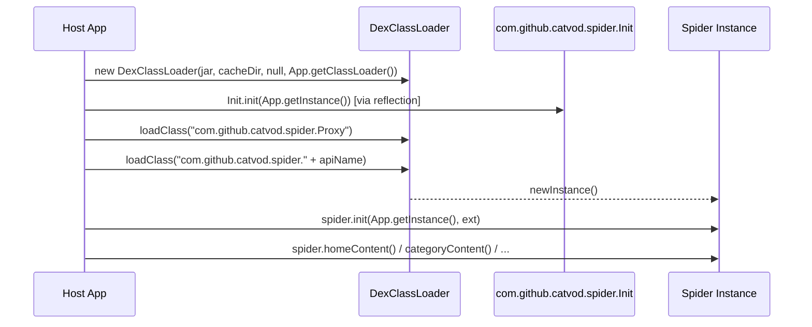

# TVBox Shell Client Analysis — Native Support Feasibility

## 1. Shell Client Inventory

| Project | Package | Init.java | DexNative | App class | JarLoader |
|---------|---------|-----------|-----------|-----------|-----------|
| **TV** (FongMi) | `com.fongmi.android.tv` | ✅ WeakRef context | ❌ | `com.fongmi.android.tv.App` | [JarLoader.java](file:///Users/sunchuxiong/kotatsu_demo/TVBoxOS/app/src/main/java/com/github/catvod/crawler/JarLoader.java) (~160 LOC) |
| **TVBoxOS** | `com.github.tvbox.osc` | ❌ (none) | ❌ | `com.github.tvbox.osc.base.App` | [JarLoader.java](file:///Users/sunchuxiong/kotatsu_demo/TVBoxOS/app/src/main/java/com/github/catvod/crawler/JarLoader.java) (~250 LOC) |
| **XMBOX** | `com.fongmi.android.tv` | ✅ WeakRef context | ❌ | Same as FongMi | Same as FongMi |

> [!IMPORTANT]
> **No shell client has [DexNative](file:///Users/sunchuxiong/kotatsu_demo/Kototoro/app/src/main/kotlin/org/skepsun/kototoro/core/parser/tvbox/TVBoxJarSpiderExecutor.kt#2079-2089) or Guard support.** [DexNative](file:///Users/sunchuxiong/kotatsu_demo/Kototoro/app/src/main/kotlin/org/skepsun/kototoro/core/parser/tvbox/TVBoxJarSpiderExecutor.kt#2079-2089) is injected by Guard spider jars themselves at class-load time, overriding the host's [Init.java](file:///Users/sunchuxiong/kotatsu_demo/TV/catvod/src/main/java/com/github/catvod/Init.java).

---

## 2. Shared Loading Contract

All shells follow the **exact same** spider lifecycle:



### Critical Details

1. **Parent ClassLoader**: Always `App.get().getClassLoader()` — the host app's own classloader
2. **Cache Dir**: `App.getInstance().getCacheDir() + "/catvod_csp"` for DEX optimization
3. **Library Search Path**: Always `null` (or `cachePath` in FongMi for `.so` lookup)
4. **Init Context**: `App.getInstance()` — a real [Application](file:///Users/sunchuxiong/kotatsu_demo/Kototoro/app/src/main/java/com/github/tvbox/osc/base/App.java#469-478) object
5. **No special packaging required** — spiders only need the host to provide `Init.context()` and standard Android [Context](file:///Users/sunchuxiong/kotatsu_demo/TV/catvod/src/main/java/com/github/catvod/net/OkHttp.java#208-217) APIs

---

## 3. Host Environment Contract

Spiders assume the following at runtime:

### 3.1 `com.github.catvod.spider.Init` (host-side)
```java
// FongMi / XMBOX version (identical)
public class Init {
    private WeakReference<Context> context;
    public static void set(Context context) { ... }
    public static Context context() { ... }
}
```
- Spiders call `Init.context()` to get [getCacheDir()](file:///Users/sunchuxiong/kotatsu_demo/Kototoro/app/src/main/kotlin/org/skepsun/kototoro/core/parser/tvbox/TVBoxJarSpiderExecutor.kt#2086-2088), [getFilesDir()](file:///Users/sunchuxiong/kotatsu_demo/Kototoro/app/src/main/kotlin/org/skepsun/kototoro/core/parser/tvbox/TVBoxJarSpiderExecutor.kt#2062-2063), etc.
- Some jars bring their **own** [Init.java](file:///Users/sunchuxiong/kotatsu_demo/TV/catvod/src/main/java/com/github/catvod/Init.java) with extra fields (`loader`, `Application app`).

### 3.2 `com.github.catvod.net.OkHttp` (host-side)
- Provides `OkHttp.client()`, `OkHttp.string(url)`, `OkHttp.newCall(url, headers)`
- Spiders call `Spider.client()` which delegates to `OkHttp.client()`

### 3.3 `com.github.catvod.utils.Path` (host-side)
- `Path.cache()` → `Init.context().getCacheDir()`
- `Path.files()` → `Init.context().getFilesDir()`
- `Path.jar()` → cache dir for jar files

### 3.4 `com.github.tvbox.osc.base.App` (TVBoxOS only)
- TVBoxOS spiders sometimes reference `App.getInstance()` directly
- Must be a real [Application](file:///Users/sunchuxiong/kotatsu_demo/Kototoro/app/src/main/java/com/github/tvbox/osc/base/App.java#469-478) subclass with [getPackageName() == "com.github.tvbox.osc"](file:///Users/sunchuxiong/kotatsu_demo/TV/app/src/main/java/com/fongmi/android/tv/App.java#67-71)

---

## 4. DexNative / Guard Mechanism (Jar-side, NOT host-side)

Guard spiders (e.g., `WexReBoGuard`) are **shell classes** that delegate to a real spider hidden behind JNI encryption:

```
WexReBoGuard (jar) → has field: Spider delegate
    └── Init.getSpider("WexReBo") → DexNative.getSpider(loader, "WexReBo")
        └── JNI call → decrypts .guard file → returns real Spider
```

- Guard's own [Init.java](file:///Users/sunchuxiong/kotatsu_demo/TV/catvod/src/main/java/com/github/catvod/Init.java) (in the jar) has: `Application app`, `DexClassLoader loader`, [getSpider()](file:///Users/sunchuxiong/kotatsu_demo/TVBoxOS/app/src/main/java/com/github/catvod/crawler/JarLoader.java#169-204), `loader()` methods
- **This [Init.java](file:///Users/sunchuxiong/kotatsu_demo/TV/catvod/src/main/java/com/github/catvod/Init.java) overrides the host's** because `DexClassLoader` with parent-first delegation loads jar classes first if they exist

> [!TIP]
> The key insight: Guard jars' [Init.java](file:///Users/sunchuxiong/kotatsu_demo/TV/catvod/src/main/java/com/github/catvod/Init.java) expects [app](file:///Users/sunchuxiong/kotatsu_demo/TV/app) and `loader` fields to be populated before [getSpider()](file:///Users/sunchuxiong/kotatsu_demo/TVBoxOS/app/src/main/java/com/github/catvod/crawler/JarLoader.java#169-204) is called. In a real TVBox shell, this happens naturally because `Init.init(app)` populates both fields via the jar's own static initializer/constructor.

---

## 5. What Kototoro's Companion Does vs. What's Needed

### Current Architecture (Companion Process)
```
Kototoro Main Process ──IPC──> TVBox Companion Process
                                 ├── com.github.tvbox.osc.base.App (bridge)
                                 ├── DexClassLoader + Init
                                 └── Spider execution
```

### Why the Companion Exists
1. **Package name spoofing**: Spiders check `context.getPackageName() == "com.github.tvbox.osc"`
2. **ClassLoader isolation**: Prevent spider classes from polluting host
3. **Crash isolation**: JNI crashes (Guard SIGABRT) don't kill the main app

### What's Needed for In-Process (No Companion)

| Requirement | How Shells Solve It | How Kototoro Can Solve It |
|-------------|--------------------|-----------------------|
| [getPackageName() = "com.github.tvbox.osc"](file:///Users/sunchuxiong/kotatsu_demo/TV/app/src/main/java/com/fongmi/android/tv/App.java#67-71) | Real package name | Kototoro already has [App.java](file:///Users/sunchuxiong/kotatsu_demo/TV/app/src/main/java/com/fongmi/android/tv/App.java) bridge that spoofs this |
| `App extends Application` with [getInstance()](file:///Users/sunchuxiong/kotatsu_demo/TVBoxOS/app/src/main/java/com/github/tvbox/osc/base/App.java#73-76) | Real application | Use existing [App.java](file:///Users/sunchuxiong/kotatsu_demo/TV/app/src/main/java/com/fongmi/android/tv/App.java) bridge (already works) |
| `Init.set(context)` / `Init.init(context)` | Called in `JarLoader.load()` | Already done in [createSpider](file:///Users/sunchuxiong/kotatsu_demo/Kototoro/app/src/main/kotlin/org/skepsun/kototoro/core/parser/tvbox/TVBoxJarSpiderExecutor.kt#251-413) |
| `DexClassLoader` parent = host classloader | `App.get().getClassLoader()` | Use Kototoro's app classloader |
| `OkHttp.client()` available | Bundled in [catvod](file:///Users/sunchuxiong/kotatsu_demo/TV/catvod) module | **Need to bundle [catvod](file:///Users/sunchuxiong/kotatsu_demo/TV/catvod) net/utils OR proxy via host** |
| `Path.cache()` / `Path.files()` returns valid dirs | Uses `Init.context()` | Already works via context seeding |

---

## 6. Feasibility Assessment

### ✅ Fully Feasible — In-Process Execution Without Companion

The analysis confirms that **all three shell clients are simply providing**:
1. A `DexClassLoader` with the host's classloader as parent
2. An [Application](file:///Users/sunchuxiong/kotatsu_demo/Kototoro/app/src/main/java/com/github/tvbox/osc/base/App.java#469-478) context with [getPackageName() = "com.github.tvbox.osc"](file:///Users/sunchuxiong/kotatsu_demo/TV/app/src/main/java/com/fongmi/android/tv/App.java#67-71) 
3. The [catvod](file:///Users/sunchuxiong/kotatsu_demo/TV/catvod) module classes ([Init](file:///Users/sunchuxiong/kotatsu_demo/XMBOX/catvod/src/main/java/com/github/catvod/Init.java#7-27), [OkHttp](file:///Users/sunchuxiong/kotatsu_demo/TV/catvod/src/main/java/com/github/catvod/net/OkHttp.java#31-236), [Path](file:///Users/sunchuxiong/kotatsu_demo/TV/catvod/src/main/java/com/github/catvod/utils/Path.java#19-243), [Spider](file:///Users/sunchuxiong/kotatsu_demo/CatVodSpider)) compiled into the host APK

### Migration Path

1. **Embed [catvod](file:///Users/sunchuxiong/kotatsu_demo/TV/catvod) module** directly into Kototoro (already partially done via `tvbox-bridge-api`)
   - Add: `com.github.catvod.net.OkHttp` + interceptors
   - Add: `com.github.catvod.utils.Path`, `Util`, [Json](file:///Users/sunchuxiong/kotatsu_demo/Kototoro/app/src/main/kotlin/org/skepsun/kototoro/core/parser/tvbox/TVBoxJarSpiderRuntime.kt#1015-1022)
   - Keep: existing `com.github.catvod.crawler.Spider` and [Init](file:///Users/sunchuxiong/kotatsu_demo/XMBOX/catvod/src/main/java/com/github/catvod/Init.java#7-27)

2. **Replace IPC with direct invocation** in [TVBoxJarSpiderExecutor](file:///Users/sunchuxiong/kotatsu_demo/Kototoro/app/src/main/kotlin/org/skepsun/kototoro/core/parser/tvbox/TVBoxJarSpiderExecutor.kt#44-2143)
   - Remove companion service calls
   - Load jar via `DexClassLoader` in-process
   - Call `Init.init(bridgeApp)` → [loadClass](file:///Users/sunchuxiong/kotatsu_demo/TVBoxOS/app/src/main/java/com/github/catvod/crawler/JarLoader.java#63-120) → `newInstance` → `spider.init()`
   - **This is essentially what `TVBoxJarSpiderExecutor.createSpider()` already does!**

3. **Guard support** requires only:
   - Passing the `DexClassLoader` to `Init.loader` field (already done)
   - Providing `librarySearchPath` for `.so` files (already done)
   - The JNI null-safety checks (already added)

4. **Crash isolation** (optional safety net):
   - Wrap spider calls in `try/catch` with uncaught exception handlers
   - Use process-level isolation only for known-problematic Guard spiders

> [!CAUTION]
> The one remaining risk is **JNI Guard crashes** (SIGABRT). These kill the entire process. Options:
> - Keep companion process **only** for Guard spiders
> - Run Guard spiders in a separate thread group with signal handling
> - Accept the risk (real TVBox shells do accept it)
