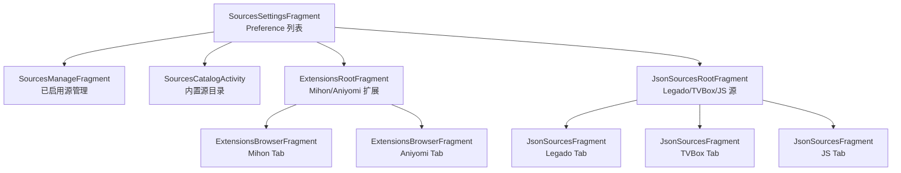
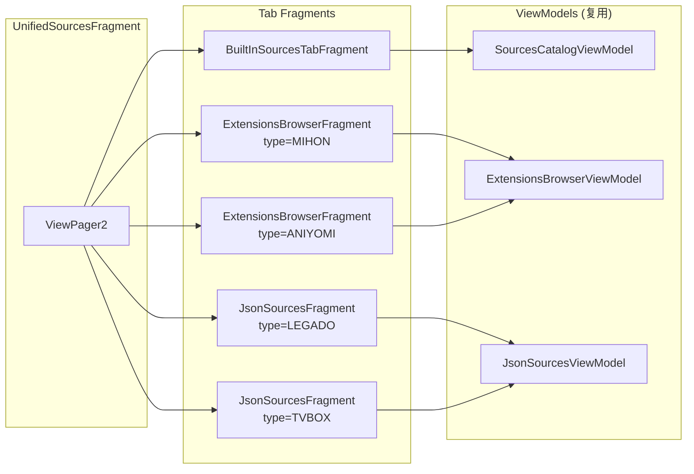

# 统一源管理 UI 重构方案

> **Status**: Draft / 待讨论  
> **Scope**: 大型重构，预计分 4-5 个阶段实施  
> **Created**: 2026-03-22

## 1. 目标

将目前分散在多处的源管理 UI（内置源、Mihon/Aniyomi 扩展、Legado/TVBox/JS JSON 源）统一为 **一个带分页标签的界面**，展示风格一致，每个 tab 保留各自的导入方式。

## 2. 现状分析

### 当前入口路径（从 Settings → Content Sources 进入）



### 现有组件清单

| 区域 | 文件/类 | UI 风格 | 功能 |
|------|---------|---------|------|
| **入口** | `SourcesSettingsFragment` | Preference 列表 | 4 个跳转入口 + 全局设置 |
| **内置源目录** | `SourcesCatalogActivity` | Activity + RecyclerView + chips 过滤 | 内容类型/语言过滤、搜索、启用源 |
| **源管理** | `SourcesManageFragment` | RecyclerView + 拖拽排序 | 启用/禁用、排序、搜索 |
| **Mihon/Aniyomi** | `ExtensionsRootFragment` → `ExtensionsBrowserFragment` | ViewPager2 + RecyclerView | 安装/卸载/更新、语言过滤、仓库管理 |
| **Legado/TVBox/JS** | `JsonSourcesRootFragment` → `JsonSourcesFragment` | ViewPager2 + RecyclerView | JSON 导入/编辑/删除、分组展示 |

### 关键差异

| | 内置源 | Mihon/Aniyomi | Legado/TVBox/JS |
|---|---|---|---|
| **数据来源** | 编译时硬编码 | APK 包安装 + 仓库索引 | JSON 配置导入 |
| **导入方式** | 无（内置） | 仓库 URL → APK 下载安装 | JSON URL/文件 → 导入 |
| **列表项样式** | `SourceCatalogItemAD` | `ExtensionsBrowserAdapter` | `GroupedJsonSourcesAdapter` |
| **过滤方式** | 内容类型 + 语言 chips | 语言 filter dialog | 分组折叠 |
| **管理操作** | 启用/禁用 | 安装/卸载/更新 | 导入/编辑/删除 |

## 3. 目标架构

### 3.1 UI 结构

```
┌─────────────────────────────────────────────┐
│  [Toolbar] Content Sources               🔍  │
├─────────────────────────────────────────────┤
│  ┌──────┬────────┬─────────┬───────┬──────┐ │
│  │内置源│ Mihon  │ Aniyomi │Legado │TVBox │ │
│  └──────┴────────┴─────────┴───────┴──────┘ │
│  ┌─────────────────────────────────────────┐ │
│  │                                         │ │
│  │   统一风格的源列表                        │ │
│  │   (RecyclerView)                        │ │
│  │                                         │ │
│  │   - 源名称                               │ │
│  │   - 语言标签                              │ │
│  │   - 启用/禁用开关                         │ │
│  │   - 状态指示                              │ │
│  │                                         │ │
│  └─────────────────────────────────────────┘ │
│                                         [＋] │
└─────────────────────────────────────────────┘
```

### 3.2 分页详情

| Tab | 内容 | ＋ 按钮行为 | 已有可复用组件 |
|-----|------|------------|---------------|
| **内置源** | 所有内置源列表，带启用/禁用开关 | 无需（或打开内置源筛选面板） | `SourcesCatalogViewModel` |
| **Mihon** | 已安装 + 可用 Mihon 扩展 | 打开 Mihon 仓库管理 | `ExtensionsBrowserViewModel` |
| **Aniyomi** | 已安装 + 可用 Aniyomi 扩展 | 打开 Aniyomi 仓库管理 | `ExtensionsBrowserViewModel` |
| **Legado** | 已导入的 Legado 书源 | 打开 JSON 导入 dialog | `JsonSourcesViewModel` |
| **TVBox** | 已导入的 TVBox 源 | 打开 JSON 导入 dialog | `JsonSourcesViewModel` |

### 3.3 统一列表项样式

```
┌──────────────────────────────────────────┐
│  [Icon]  源名称                    [开关] │
│          语言: zh  ·  类型: Manga         │
│          版本: 1.4.2  ·  10 个子源        │
└──────────────────────────────────────────┘
```

各 tab 的列表项共享相同的视觉风格（参考现有 `SourcesManageFragment` 的卡片样式），但数据字段可根据源类型适配：

- **内置源**: 源名、语言、内容类型、启用状态
- **Mihon/Aniyomi**: 扩展名、版本、语言、安装状态/进度
- **Legado/TVBox**: 源名、URL、类型、来源 JSON

## 4. 实施阶段

### Phase 1: 统一容器框架

**目标**: 创建顶层 `UnifiedSourcesFragment`，用 ViewPager2 + TabLayout 承载所有 tab。

**新增文件**:
- `UnifiedSourcesFragment.kt` — 顶层容器
- `UnifiedSourcesPagerAdapter.kt` — ViewPager2 适配器
- `fragment_unified_sources.xml` — 布局（TabLayout + ViewPager2 + FAB）

**修改文件**:
- `SourcesSettingsFragment.kt` — 将多个入口合并为一个指向 `UnifiedSourcesFragment`
- 导航路由 — 更新 `AppRouter` 添加新目的地

### Phase 2: 迁移内置源 Tab

**目标**: 将 `SourcesCatalogActivity` 从 Activity 改造为 Fragment，嵌入到 ViewPager2 的第一个 tab。

**修改文件**:
- `SourcesCatalogActivity.kt` → 提取核心逻辑到 `BuiltInSourcesTabFragment.kt`
- `SourcesCatalogViewModel.kt` — 复用，无需大改
- `SourcesCatalogAdapter.kt` / `SourceCatalogItemAD.kt` — 复用

**注意**: `SourcesCatalogActivity` 可暂时保留用于兼容，后续移除。

### Phase 3: 迁移 Mihon/Aniyomi Tab

**目标**: 将现有 `ExtensionsBrowserFragment` 直接嵌入新 ViewPager2（替代 `ExtensionsRootFragment`）。

**修改文件**:
- `UnifiedSourcesPagerAdapter.kt` — 添加 Mihon/Aniyomi 位置的 Fragment 创建
- `ExtensionsBrowserFragment.kt` — 适配 FAB 按钮（＋ → 打开仓库管理）
- 移除 `ExtensionsRootFragment.kt`（不再需要独立的两层嵌套 ViewPager）

**风格统一**:
- 使已安装扩展的列表项样式与内置源卡片保持一致
- 保留安装状态指示和进度条

### Phase 4: 迁移 Legado/TVBox Tab

**目标**: 将 `JsonSourcesFragment` 嵌入 ViewPager2 的后两个 tab。

**修改文件**:
- `UnifiedSourcesPagerAdapter.kt` — 添加 Legado/TVBox 位置
- `JsonSourcesFragment.kt` — 适配 FAB 按钮（＋ → 打开 JSON 导入 dialog）
- 移除 `JsonSourcesRootFragment.kt`

**考虑**: JS 源是否需要单独 tab，还是合入 TVBox。

### Phase 5: 清理 & 打磨

- 移除废弃的 `SourcesCatalogActivity`、`ExtensionsRootFragment`、`JsonSourcesRootFragment`
- 统一列表项视觉风格（统一卡片高度、间距、排版）
- 全局搜索：toolbar 搜索框跨所有 tab 搜索
- 统一 empty state 样式
- 迁移全局设置（NSFW 过滤、语言过滤）到 toolbar 菜单

## 5. 数据流与架构



每个 tab Fragment 保留自己的 ViewModel，数据层无需修改。重构主要在 UI 层。

## 6. FAB（＋ 按钮）行为映射

| 当前 Tab | FAB 点击行为 |
|----------|-------------|
| 内置源 | 无 FAB（或打开筛选面板） |
| Mihon | 打开 `ExtensionRepositoriesFragment`（Mihon 仓库管理） |
| Aniyomi | 打开 `ExtensionRepositoriesFragment`（Aniyomi 仓库管理） |
| Legado | 打开 `ImportJsonDialogFragment`（JSON 导入，type=LEGADO） |
| TVBox | 打开 `ImportJsonDialogFragment`（JSON 导入，type=TVBOX） |

FAB 的 icon 和行为随 tab 切换动态更新。内置源 tab 下 FAB 隐藏。

## 7. 影响评估

### 涉及文件（估算 30+）

| 类别 | 新增 | 修改 | 删除 |
|------|------|------|------|
| 容器框架 | 3 | 2 | 0 |
| 内置源迁移 | 1 | 3 | 1 |
| 扩展迁移 | 0 | 3 | 1 |
| JSON 源迁移 | 0 | 3 | 1 |
| 清理打磨 | 1 | 5+ | 3 |
| 布局 XML | 1-2 | 3-5 | 2-3 |
| 导航/路由 | 0 | 2-3 | 0 |
| **合计** | ~6 | ~20+ | ~8 |

### 风险点

1. **ViewPager2 嵌套**: 现有 Extensions 和 JSON 已各自用了 ViewPager2，迁移后变成单层，降低复杂度
2. **Fragment 状态保存**: ViewPager2 中 Fragment 的 lifecycle 需要正确处理
3. **Menu 冲突**: 每个 tab Fragment 有不同的 toolbar menu，切换时需清理
4. **性能**: 5 个 tab 的 offscreen limit 需要合理设置，避免同时加载过多
5. **回归测试**: 所有源管理功能（安装/卸载/导入/编辑/删除/搜索/过滤）需逐一验证

## 8. 时间估算

| 阶段 | 预计工作量 |
|------|-----------|
| Phase 1: 容器框架 | 1 个会话 |
| Phase 2: 内置源 Tab | 1 个会话 |
| Phase 3: Mihon/Aniyomi Tab | 1 个会话 |
| Phase 4: Legado/TVBox Tab | 1 个会话 |
| Phase 5: 清理打磨 | 1-2 个会话 |
| **总计** | **5-6 个会话** |

## 9. 备选方案

### 方案 B: 渐进式统一

不创建全新容器，而是：
1. 保留现有 `SourcesSettingsFragment` 作为入口
2. 统一各子页面的列表项样式
3. 在 `SourcesManageFragment` 中合并展示所有已启用源（跨类型混合）

**优点**: 工作量小（~2 会话），风险低  
**缺点**: 入口仍分散，不如方案 A 统一

### 方案 C: 二级 Tab 混合

保留当前的两层结构，但将 Extensions 和 JSON 源合并：

```
内置源管理（现有页面优化）
├── Mihon  ─┐
├── Aniyomi ─┤── 扩展 Tab（现有 ExtensionsRootFragment 扩展）
├── Legado  ─┤
├── TVBox   ─┤── JSON Tab（现有 JsonSourcesRootFragment 扩展）
└── JS      ─┘
```

**优点**: 改动最小（~1 会话）  
**缺点**: 仍然是分散的入口
